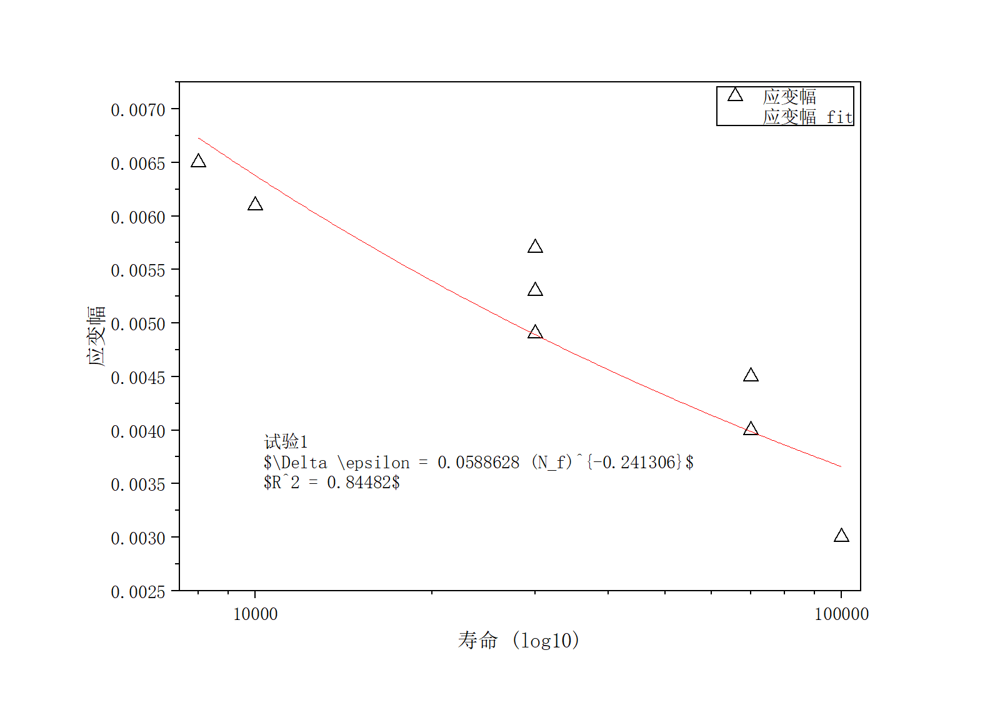

# OriginNSFit

OriginNSFit 用于批量读取 S-N 试验数据，按组拟合 S-N 曲线，并通过 Origin 自动绘图导出。

当前默认模型：

```text
response = a * life^b
```

图中公式使用 LaTeX 风格显示：

```text
\Delta \epsilon = a (N_f)^b
```

其中 `life` 默认识别为 `寿命` 列，`response` 默认识别为 `应变幅` 或 `应力幅` 列。横坐标在 Origin 图中使用 `log10` 对数坐标。

## 效果图



## 数据格式

CSV 可以包含多组试验块，格式参考 [examples/example.csv](examples/example.csv)：

```csv
试验1,,
试样ID,应变幅,寿命
YZ3SD-001,0.003,100000
YZ3SD-002,0.003,100000

试验2,,
试样ID,应变幅,寿命
YZ4SD-001,0.003,100000
```

每个 `试验X,,` 会被识别为一组，程序会分别拟合并分别绘图。

## 环境准备

联网环境：

```powershell
python -m venv .venv
.\.venv\Scripts\python.exe -m pip install --upgrade pip setuptools wheel
.\.venv\Scripts\python.exe -m pip install -r requirements-build.txt
.\.venv\Scripts\python.exe -m pip install --no-build-isolation --no-deps -e .
```

离线环境请看 [offline/README.md](offline/README.md)。

## 验证拟合

只拟合并输出结果，不启动 Origin：

```powershell
.\.venv\Scripts\python.exe -m originnsfit --input examples --output output --pattern example.csv --dry-run
```

输出文件：

```text
output/fit_summary.csv    每组拟合系数、R2、RMSE、公式和图片路径
output/fit_curves.csv     每组拟合曲线采样点
```

## Origin 绘图

电脑上安装 Origin / OriginPro 后，去掉 `--dry-run`：

```powershell
.\.venv\Scripts\python.exe -m originnsfit --input data --output output --pattern "*.csv"
```

每组图会保存到：

```text
output/figures/
```

图中包含：

- 原始数据点，默认三角符号。
- 幂律拟合曲线。
- 代入拟合系数后的公式和 R2。
- `log10` 寿命横坐标。

如果列名不同，可以手动指定：

```powershell
.\.venv\Scripts\python.exe -m originnsfit --input data --output output --life "N" --response "S"
```

## 打包 exe

```powershell
.\.venv\Scripts\pyinstaller.exe OriginNSFit.spec
```

打包结果会输出到：

```text
dist\OriginNSFit.exe
```

## 目录

```text
src/originnsfit/       Python 包源码
examples/              示例 S-N 数据
data/                  本地批量输入数据，默认忽略
output/                拟合结果和导出图像，默认忽略
offline/               离线部署教程和 wheel 资源
```
